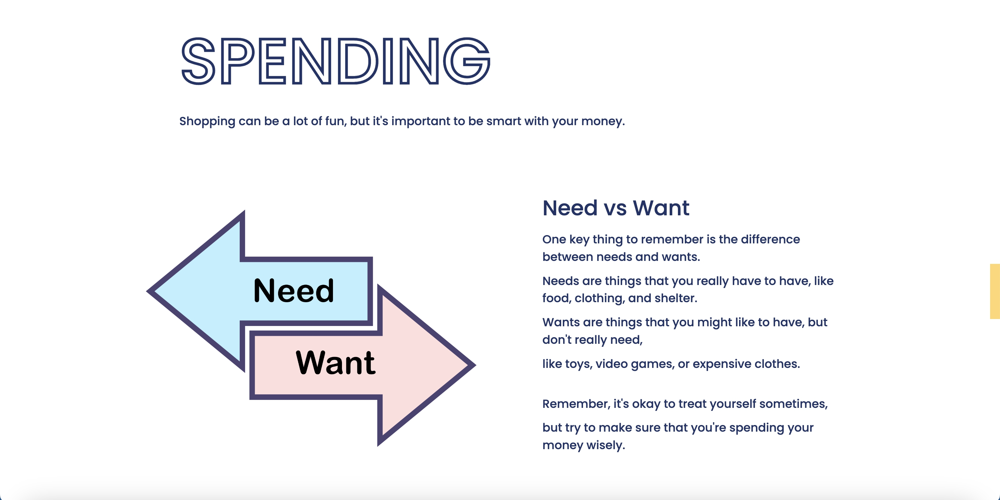
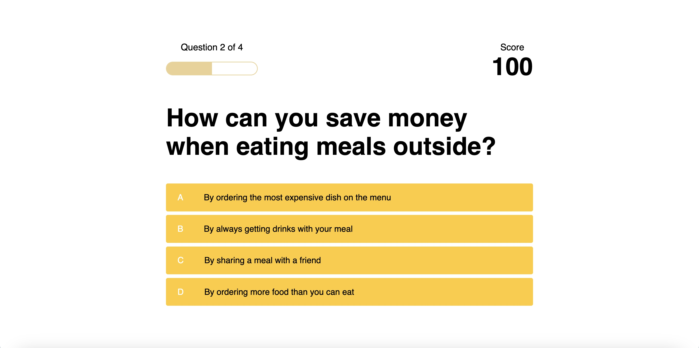
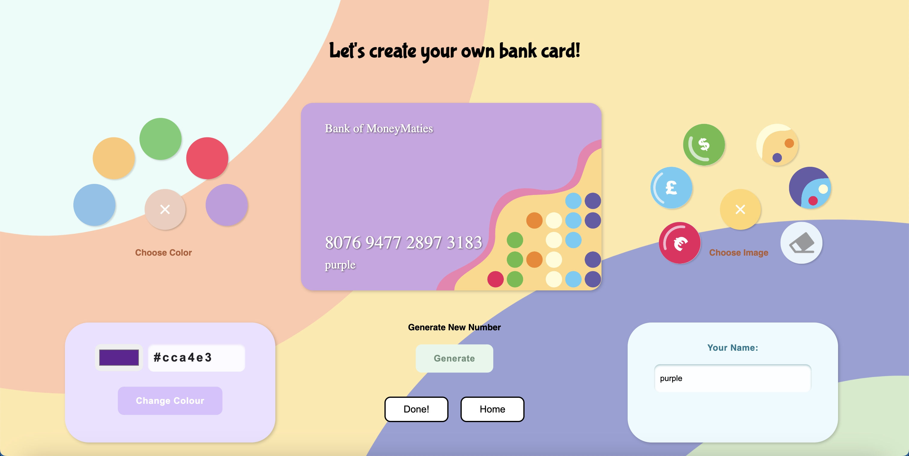
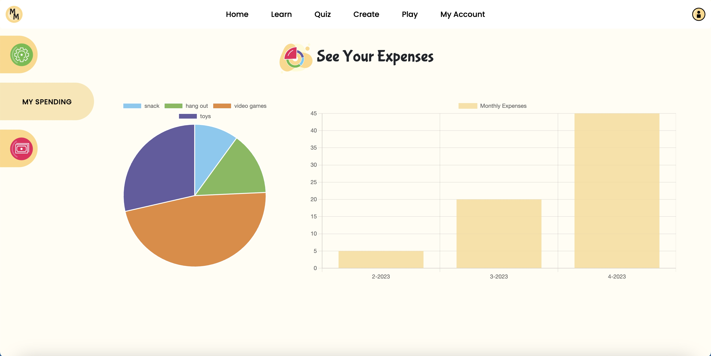

This website features a fun platform for young learners to discover the basics of spending & saving money, manage personal finances, understand some world currencies, and most importantly - enjoy these activities in an interactive and engaging way.

Upon logging in or signing up, young learners can access easy-to-understand information and practical activities to improve their financial literacy - covering topics such as saving, spending, and an introduction to world currencies. Additionally, they can also attempt fun educational quizzes to help reinforce the concepts they have learned.

One of the unique features of the website is the ability for young learners to design their own personalized bank card, allowing the user to explore their creativity. Another key feature is its user-friendly accounting system - enabling young learners to keep track of their expenses and savings. 

With a bright, lively and inviting UI, this website creates an immersive and engaging environment for young learners to expand their financial knowledge and practice.